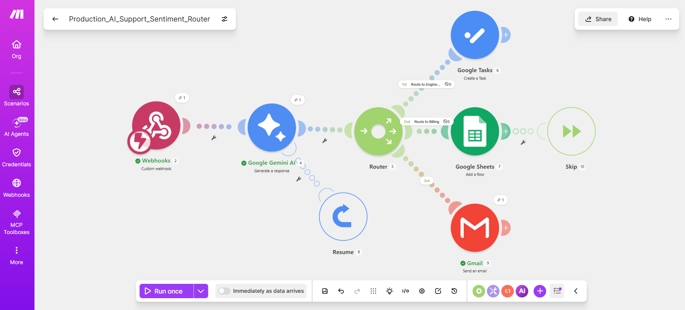

# Production_AI_Support_Sentiment_Router

A production-grade, asynchronous AI triage and incident-routing pipeline built to handle enterprise support ticketing. This system intercepts live webhook data packets, processes them through a generative reasoning engine for multi-dimensional analysis, and dynamically dispatches payloads across specialized operational tracks with built-in fault tolerance.

---

## 🛠️ Core Technical Competencies
*   **AI Integration & Parsing:** Advanced prompt engineering using `gemini-3.5-flash` to enforce structured text evaluation, executing real-time extraction of Sentiment, Priority, and Routing fields from unstructured ticket data.
*   **Traffic Management & Flow Control:** Implemented an array-based variable mapping matrix and conditional routing logic (`Contains (case insensitive)`) to segregate data streams flawlessly.
*   **System Resiliency & Hardening:** Engineered structural fail-safes utilizing Make.com global error handling directives (`Resume` with structural array injection and `Ignore/Skip` blocks) to prevent processing deadlocks during upstream API drops.

---

## 🚀 System Architecture & Components

### 1. Ingestion Layer (`Webhooks`)
*   Deployed an instantaneous custom HTTP POST Webhook listener configured to accept raw JSON payloads containing client credentials (`customer_email`), header topics (`ticket_subject`), and primary core text arrays (`message_body`).

### 2. Generative Triage Engine (`Google Gemini AI`)
*   Processes incoming string text dynamically to run live ticket analysis.
*   **Hardened Failover Matrix:** Attached an inline `Resume` error handler to the AI module. In the event of a temporary LLM API rate-limit (429) or service interruption, it injects a worst-case emergency fallback data string (`Sentiment: Urgent, Priority: High, Route: Engineering`) to guarantee critical incidents are never dropped.

### 3. Dynamic Routing Matrix (`Router`)
Evaluates the metadata output from the AI layer and splits operational execution into three distinct enterprise pathways:
*   **Engineering Route:** Triggers when the payload contains `Route: Engineering`. Dynamically updates operational queues by generating unique tracking items inside **Google Tasks**.
*   **Billing Route:** Triggers when the payload contains `Route: Billing`. Appends structured transaction records to a tracking ledger via **Google Sheets** (protected by an independent `Skip` error handler).
*   **Customer Success Route:** Triggers when the payload contains `Route: Customer_Success`. Automatically generates and delivers a contextual, data-populated customer acknowledgment email via **Gmail**.

## 📂 Live Ingress Demonstration & Deployment
* **Live Ingress Interface (Google Form)**: https://forms.gle/Rd4Bw3Q5dUbqY3j79

### Installation Steps:
1. Create an account at **Make.com**.
2. Create a new scenario, click **More Options (...)** in the bottom menu, and select **Import Blueprint**.
3. Upload the blueprint file (`.json` or `.txt`) included in this repository.
4. Connect your target Google Sheet (linked to your respective Google Form configuration), input your Gemini API Key, and authorize your Gmail account.
5. Toggle the Scenario settings to **"Allow storing incomplete executions"** to fully enable the enterprise self-healing loop.

## 📸 Architecture Visualizations

### End-to-End Production Pipeline

*(To display your chart here, take a clean screenshot of your Make.com canvas, name the file `blueprint.png`, and upload it directly into the same GitHub repository folder as this README file).*
